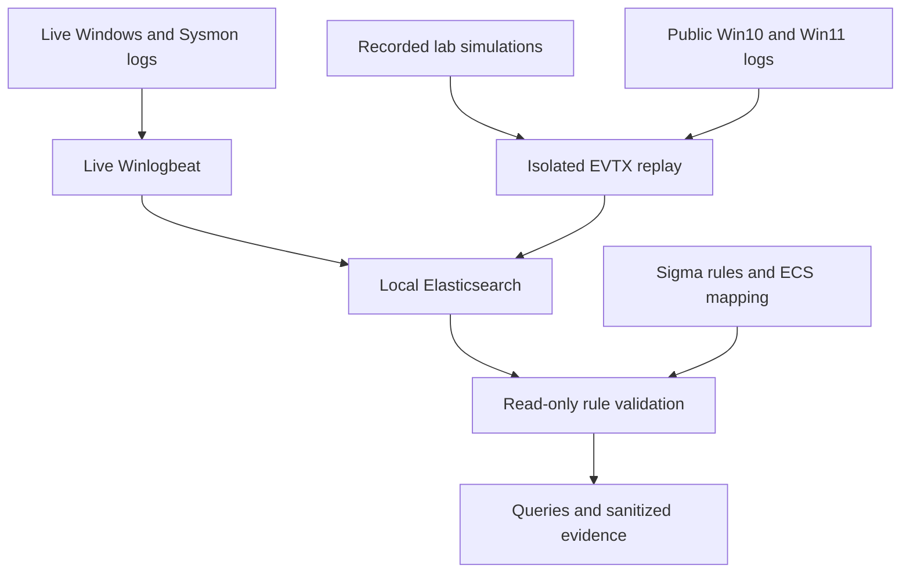

# Sigma Detection Lab

A Windows detection-engineering project by Samuel Yoder, with AI-assisted
rule, code, and documentation drafting. Six experimental Sigma rules are
converted to Elastic EQL and measured against recorded attack simulations,
public benign Windows logs, and a live host. Every rule ships with its
detection logic, telemetry requirements, measured results, coverage gaps, and
limitations.

## Contents

- [At a glance](#at-a-glance)
- [What this project is](#what-this-project-is)
- [Final measured results](#final-measured-results)
- [Evidence-driven tuning](#evidence-driven-tuning)
- [Live positive controls](#live-positive-controls)
- [The six rules](#the-six-rules)
- [Telemetry requirements](#telemetry-requirements)
- [How it works](#how-it-works)
- [How it was built](#how-it-was-built)
- [Repository layout](#repository-layout)
- [Reproduce it](#reproduce-it)
- [Reuse the rules elsewhere](#reuse-the-rules-elsewhere)
- [Datasets and provenance](#datasets-and-provenance)
- [Coverage gaps and limitations](#coverage-gaps-and-limitations)
- [Future work](#future-work)
- [Documentation](#documentation)
- [Attribution and license](#attribution-and-license)

## At a glance

- **What it is:** six experimental Sigma rules for Windows, each mapped to
  MITRE ATT&CK, converted to Elastic EQL, and measured against four separate
  datasets.
- **Data:** 37,364 recorded attack-simulation events, 1,792,766 public benign
  Windows 10/11 events, and a private live-host baseline.
- **Result:** every rule matches recorded simulation samples. Four rules also
  match public baseline events; those matches are reported, not tuned away.
- **Live check:** three of four harmless live controls were detected end to
  end. The fourth exposed a collection gap, which is documented.
- **Limits:** 12 of the 18 rule/baseline result cells had no relevant behavior
  to evaluate. They are marked in the results table and are not clean results.

## What this project is

The goal is a small ruleset that can be explained, converted, tested, and
reused, with its weaknesses stated as plainly as its results.

Delivered:

- Six ATT&CK-mapped Sigma rules with stable IDs, references, and documented
  legitimate matching behaviors.
- Conversion from generic Sigma to Elastic EQL, with a local mapping for the
  fields a Winlogbeat lab actually indexes.
- A validation runner that measures each rule against four separate corpora
  and proves the EQL query and an exact-count query return the same documents.
- Before and after measurements for two tuning changes, with each tradeoff.
- Tests that pin known gaps and known noise, and one that fails if the
  published tables differ from the measured evidence.
- Harmless live positive controls with a read-only end-to-end check.

Not delivered: scheduled SIEM alerts, notifications, automated response, or
production readiness. All six rules are **experimental**.

## Final measured results

Snapshot: **2026-10-05 18:45:48 UTC**. All **24 rule/corpus EQL document-ID
comparisons matched** the exact-count results. The rule files here match the
measured ones except for the `author` line, which was shortened after
measurement. The project check restores that line and verifies the measured
hashes.

| Rule | Attack hits | Live-host hits | Win10 hits | Win11 hits | Matched/precursor attack files |
| --- | ---: | ---: | ---: | ---: | ---: |
| LSASS selected read masks | 26 | n/a | n/a | 86 | 14/14 |
| Encoded PowerShell | 1 | 0* | n/a | 0 | 1/12 |
| Run-key suspicious value | 4 | 0* | n/a | 2 | 4/6 |
| Schtasks creation | 7 | 0 | n/a | 9 | 6/8 |
| Windows log clearing | 26 | n/a | 1 | n/a | 26/26 |
| WMI consumer binding | 5 | n/a | n/a | n/a | 3/3 |

**Baseline columns.** `n/a` means the corpus contained no eligible events for
that rule (no event of the required type with the required fields), so the
rule had nothing to evaluate. For log clearing and WMI binding the eligible
event is the rule's own trigger, so `n/a` means it did not occur. `0*` means
eligible events existed but none showed the precursor behavior, for example
process starts but no PowerShell start. Only a plain number reflects a rule
evaluated against relevant behavior: 6 of the 18 baseline cells. The public
Win10 corpus contributed no eligible Sysmon events for any Sysmon-based rule.

**Attack columns.** Hits are matching events, not confirmed malicious
incidents or adjudicated true positives. A precursor file contains a broader
observable signal defined in `lab/rule-tests.yml`, such as any LSASS access or
any PowerShell start. The file fraction is observable-signal coverage, not
technique-wide recall.

**Baseline hits.** These are noise observations, assuming the public corpus
is benign. They are not confirmed false positives or a statistical
false-positive rate. Plain zeros need context too: public Win11 had only eight
PowerShell starts. Zero hits does not establish zero false positives. Exact
denominators are in [coverage/RESULTS.md](coverage/RESULTS.md).

## Evidence-driven tuning

Two rules were changed after reviewing the first measurement. Both versions
were measured, and the first-run rule files are kept in
`coverage/initial-rules/`.

| Change | Attack hits | Win11 baseline hits | Reason and tradeoff |
| --- | ---: | ---: | --- |
| Add LSASS masks `0x101ffb` and `0x1f1fff` | 24 → 26 | 86 → 86 | Both include PROCESS_VM_READ; matched files rose from 12 to 14 at no baseline cost |
| Include `/create /xml` task creation | 5 → 7 | 1 → 9 | Two more recorded events, eight more baseline events; matched files rose from 4 to 6 |

The second change shows the tradeoff. Admitting XML-based task creation
caught a valid creation path and exposed routine software activity: the eight
added baseline events had `officeclicktorun.exe` or `integrator.exe` as the
parent process. No executable-name exclusions were added to force the baseline
back to zero, because a file name does not authenticate a binary.

The same attack data informed the tuning and the second measurement, so this
is a regression measurement on those samples, not an independent holdout
evaluation.

## Live positive controls

Recorded data shows that a query matches stored events, not that a live host
produces them. After the snapshot, four harmless controls were run on the
live host to test the full path from Sysmon through Winlogbeat and
Elasticsearch to the committed EQL queries. Each is an ordinary administrative
action, undone immediately. No attack tool runs.

| Control | Rule | Result |
| --- | --- | --- |
| `schtasks /create ... /tr`, then delete | Schtasks creation | Detected |
| HKCU Run value containing `cmd.exe`, then delete | Run-key suspicious value | Detected |
| Clear a throwaway event log (System 104) | Windows log clearing | Detected |
| `powershell.exe -EncodedCommand` printing one word | Encoded PowerShell | **Not detected** |

The encoded PowerShell control was not detected because Sysmon on this host
recorded no process-creation event for `powershell.exe` at all, so the rule
had nothing to evaluate. The gap is in collection, upstream of the rule, and
its cause is unresolved. LSASS access and WMI subscriptions were not exercised
on a daily-use machine. These controls are new evidence, separate from the
measured snapshot. Timestamps, the investigation, and its limits are in
[docs/live-controls.md](docs/live-controls.md).

## The six rules

Each rule lists its logic, required telemetry, measurements, misses, and
benign matches. Gaps and noise marked "pinned" are asserted by
`tests/test_known_gaps.py`, so they are verified behavior, not guesses. Triage
guidance is in [docs/detection-guide.md](docs/detection-guide.md).

### 1. LSASS access with selected memory-read masks

- **Rule:** [rules/lsass_selected_read_access.yml](rules/lsass_selected_read_access.yml)
- **ATT&CK:** T1003.001, OS Credential Dumping: LSASS Memory. Level `high`.
- **Detection logic:** Sysmon event 10 where `TargetImage` ends with
  `\lsass.exe` and `GrantedAccess` is one of nine masks: `0x1010`, `0x1410`,
  `0x1438`, `0x143a`, `0x1fffff`, `0x101ffb`, `0x1f0fff`, `0x1f1fff`,
  `0x1f3fff`. Every mask contains the PROCESS_VM_READ bit (`0x10`).
- **Telemetry required:** Sysmon ProcessAccess events with `TargetImage` and
  `GrantedAccess`. The collector must be configured to record access to LSASS.
- **Measured:** 26 attack events in 14 of 14 precursor files. Public Win11: 86
  hits among 166 LSASS-access events. Live host and Win10: no eligible events.
- **Coverage gaps (pinned):** read masks outside the list, such as `0x10` and
  `0x1418`; handle duplication (`0x40`), which has no read bit. The list is an
  enumeration, not a bitwise test.
- **Known noise (pinned):** `msiexec.exe` requesting full access. In the Win11
  baseline the 86 hits came from msiexec (55), Dropbox and its updater (16),
  the Malicious Software Removal Tool (9), `csrss.exe` and `wininit.exe` (4),
  and `officeclicktorun.exe` and `wmiprvse.exe` (2).
- **Limitation:** the rule is labeled `high`, yet it matched more than half of
  the baseline LSASS-access events on one public host. Treat it as a hunting
  signal until exclusions are added and re-measured.

### 2. PowerShell with an encoded-command argument

- **Rule:** [rules/powershell_encoded_command.yml](rules/powershell_encoded_command.yml)
- **ATT&CK:** T1059.001, Command and Scripting Interpreter: PowerShell. Level `medium`.
- **Detection logic:** Sysmon event 1 where `Image` ends with
  `\powershell.exe` or `\pwsh.exe` and `CommandLine` contains one of ` -e `,
  ` -ec `, ` -en `, ` -enc `, ` -enco `, ` -encodedcommand `, each with a
  surrounding space. Matching is case-insensitive.
- **Telemetry required:** Sysmon ProcessCreate events with `Image` and
  `CommandLine`, and a collector configuration that records PowerShell starts.
- **Measured:** 1 attack event in 1 of 12 precursor files. The other 15
  recorded PowerShell starts carried no encoded-command switch, so they are
  outside the rule, not misses. Public Win11: 0 hits among 8 PowerShell starts.
  Live host: 220 process starts, none of them PowerShell. Win10: no eligible
  events.
- **Coverage gaps (pinned):** valid abbreviations such as `-encod` and
  `-encodedcomm`; the `/enc` slash form; a tab in place of the space; a renamed
  PowerShell binary. PowerShell script-block logging is not used.
- **Known noise (pinned):** ` -e ` belonging to another tool's arguments inside
  a PowerShell command line.
- **Limitation:** the evidence is one recorded sample and a small benign set.
  There is no live evidence, because the live host recorded no PowerShell
  starts.

### 3. Run or RunOnce value with selected suspicious data

- **Rule:** [rules/run_key_suspicious_value.yml](rules/run_key_suspicious_value.yml)
- **ATT&CK:** T1547.001, Registry Run Keys / Startup Folder. Level `medium`.
- **Detection logic:** Sysmon event 13 where `TargetObject` contains
  `\Software\Microsoft\Windows\CurrentVersion\Run\` or `...\RunOnce\`, and
  `Details` contains one of `powershell`, `pwsh`, `cmd.exe`, `wscript`,
  `cscript`, `mshta`, `rundll32`, `\AppData\`, `\Temp\`, `%APPDATA%`, `%TEMP%`.
- **Telemetry required:** Sysmon registry value-set events with `TargetObject`
  and string `Details`. In the Elastic lab these are `registry.path` and
  `registry.data.strings`.
- **Measured:** 4 attack events in 4 of 6 precursor files. Public Win11: 2 hits
  among 16 Run/RunOnce writes, both RunOnce values with installer-like
  context. Live host: 10,723 eligible registry events, no Run/RunOnce writes.
  Win10: no eligible events.
- **Coverage gaps (pinned):** the 32-bit Run key under `WOW6432Node`; the
  `Policies\Explorer\Run` location; payloads in `C:\Users\Public` or
  `C:\ProgramData`; `regsvr32`, which is not in the utility list. Binary
  registry data is never evaluated.
- **Known noise (pinned):** ordinary per-user applications that autostart from
  `AppData`. On a real fleet this rule will fire for them.
- **Live evidence:** a harmless HKCU Run value containing `cmd.exe` was
  detected end to end, then removed.

### 4. Scheduled task creation through schtasks

- **Rule:** [rules/schtasks_create_task.yml](rules/schtasks_create_task.yml)
- **ATT&CK:** T1053.005, Scheduled Task/Job: Scheduled Task. Level `medium`.
- **Detection logic:** Sysmon event 1 where `Image` ends with `\schtasks.exe`
  and `CommandLine` contains ` /create ` and either ` /tr ` or ` /xml `.
- **Telemetry required:** Sysmon ProcessCreate events with `Image` and
  `CommandLine`.
- **Measured:** 7 attack events in 6 of 8 precursor files; the unmatched
  commands were `/run` and `/delete`. Public Win11: 9 hits among 33 schtasks
  starts. Live host: 0 hits among 13 schtasks starts. Win10: no eligible
  events.
- **Coverage gaps (pinned):** `/change /tr`, which rewrites an existing task's
  action; tab-separated arguments; `Register-ScheduledTask` and other API
  creation, which never start `schtasks.exe`; a renamed copy of the binary.
  XML task content is not inspected.
- **Known noise (pinned):** software registering tasks from XML. The Win11
  hits had `officeclicktorun.exe` (4), `integrator.exe` (4), and TeamViewer (1)
  parent context.
- **Live evidence:** a harmless `schtasks /create ... /tr` control was detected
  end to end, then deleted.

### 5. WMI permanent consumer-filter binding

- **Rule:** [rules/wmi_consumer_filter_binding.yml](rules/wmi_consumer_filter_binding.yml)
- **ATT&CK:** T1546.003, Windows Management Instrumentation Event Subscription.
  Level `medium`.
- **Detection logic:** Sysmon event 21, the binding of a WMI event consumer to
  a filter.
- **Telemetry required:** Sysmon WmiEvent collection. Events 19 (filter) and 20
  (consumer) give context but are not part of the rule.
- **Measured:** 5 attack events in 3 of 3 precursor files. No baseline corpus
  contained a binding event.
- **Coverage gaps:** subscriptions created before collection began, and any
  host without Sysmon WmiEvent collection.
- **Known noise:** unmeasured. Legitimate management software creates the same
  bindings, and no benign example was available.
- **Limitation:** the zero baseline matches test nothing. This rule has no
  specificity evidence and was not exercised live.

### 6. Windows Security or System event log clearing

- **Rule:** [rules/windows_event_log_cleared.yml](rules/windows_event_log_cleared.yml)
- **ATT&CK:** T1685.005, Clear Windows Event Logs, under Defense Impairment in
  ATT&CK v19. Earlier ATT&CK versions listed it as T1070.001. Level `medium`.
- **Detection logic:** event 1102 in the Security channel, or event 104 in the
  System channel. The channel is part of the condition, so the event IDs are
  not matched in unrelated logs.
- **Telemetry required:** the Windows Security and System logs. No Sysmon.
- **Measured:** 26 attack events in 26 of 26 precursor files. Only two of those
  files are named for log clearing; in the others the clear may be setup or
  adjacent activity, so this is not 26 malicious clearing cases. Public Win10: 1 hit. Live host and Win11:
  no clearing event occurred.
- **Coverage gaps:** deleting log files directly, and disabling logging
  without clearing. Neither produces these events.
- **Known noise (pinned):** System 104 is matched whichever provider wrote it,
  and administrators clear logs legitimately.
- **Live evidence:** clearing a throwaway event log produced System 104 events
  that were detected end to end. No real log was cleared.

## Telemetry requirements

| Rule | Event source | Fields the rule reads | Collector requirement |
| --- | --- | --- | --- |
| LSASS access | Sysmon 10, ProcessAccess | TargetImage, GrantedAccess | Record access to `lsass.exe` |
| Encoded PowerShell | Sysmon 1, ProcessCreate | Image, CommandLine | Record PowerShell process starts |
| Run-key value | Sysmon 13, RegistryEvent | TargetObject, Details | Record Run and RunOnce value writes |
| Schtasks creation | Sysmon 1, ProcessCreate | Image, CommandLine | Record `schtasks.exe` starts |
| WMI binding | Sysmon 21, WmiEvent | EventID | Enable WmiEvent collection |
| Log clearing | Security 1102, System 104 | Channel, EventID | Collect the Security and System logs |

The collector configuration decides which events exist at all. A rule cannot
match an event that was never recorded, and its zero looks the same as a quiet
rule's. This project found exactly that on its own live host, where Sysmon
recorded no PowerShell starts. Verify collection with a positive control
before trusting a zero.

## How it works



### Ingestion

Winlogbeat ships the live host's Sysmon, Security, System, and PowerShell
logs. Recorded EVTX files are replayed through separate Winlogbeat runs that
read the files and stop; replay never executes the activity those events
describe. A tag on every document keeps the corpora apart.

| Corpus | Tag | Source labels |
| --- | --- | --- |
| Recorded attack simulations | `attack-sample` | `fields.sample_tactic`, `fields.sample_file` |
| Private live host | `baseline` | none |
| Public Win10 baseline | `benign-corpus` | `fields.corpus=win10-client`, `fields.corpus_file` |
| Public Win11 baseline | `benign-corpus` | `fields.corpus=win11-client`, `fields.corpus_file` |

### Conversion

Rules are written in generic Sigma fields. `sigma-cli` converts them with the
standard `ecs_windows` pipeline followed by a local pipeline,
[lab/ecs-winlogbeat-local.yml](lab/ecs-winlogbeat-local.yml).

| Generic Sigma field | Field searched in this lab |
| --- | --- |
| EventID, Channel | event.code, winlog.channel |
| Image, CommandLine | process.executable, process.command_line |
| TargetObject, Details | registry.path, registry.data.strings |
| TargetImage, GrantedAccess | winlog.event_data.TargetImage, winlog.event_data.GrantedAccess |

The local pipeline scopes the Sysmon-based rules to the Sysmon channel, maps
the `.caseless` field names that `ecs_windows` emits back to fields Winlogbeat
actually indexes, and maps registry `Details` to `registry.data.strings`. The
converted queries are in `converted/`.

### Validation

`scripts/validate-rules.py` measures every rule against every corpus.

1. It builds the EQL query and an exact-count Elasticsearch query from the
   same processed Sigma condition tree.
2. All exact counts in a run share one point-in-time snapshot, so a growing
   live corpus cannot shift the numbers mid-run.
3. An EQL search returns a capped number of events, so counts alone are not
   trusted. Below 10,000 matches the runner compares the complete set of
   document IDs from both queries. A mismatch on a static corpus stops the run.
4. For each rule and corpus it also counts eligible events (the right event
   type with the required fields) and precursor events (the broader behavior,
   such as any PowerShell start). These denominators separate a quiet rule
   from a blind one.
5. It writes counts, rule hashes, and public sample-file labels only. No raw
   event, host command line, or credential is saved.

`scripts/review-rule-context.py` then reduces the recorded and public matches
to fixed features, such as executable base names and access masks, for the
tuning review. It never retrieves live-host event contents.

## How it was built

### Components

| Component | Language | Purpose |
| --- | --- | --- |
| `rules/*.yml` | Sigma | The six detections |
| `lab/ecs-winlogbeat-local.yml` | pySigma pipeline | Field mapping for this lab |
| `lab/rule-tests.yml` | YAML | Eligibility and precursor definitions per rule |
| `scripts/validate-rules.py` | Python | Conversion, measurement, EQL parity |
| `scripts/review-rule-context.py` | Python | Sanitized context review of matches |
| `scripts/probe.py` | Python | Read-only localhost client and candidate discovery |
| `scripts/fetch-benign.py`, `prepare-benign-replay.py`, `replay-benign.ps1` | Python, PowerShell | Download, verify, and replay the public baselines |
| `scripts/audit-corpora.py`, `diagnose-normalization.py`, `repair-public-sysmon.py` | Python | Ingest audit and field-normalization repair |
| `scripts/live-positive-controls.ps1`, `check-live-controls.py` | PowerShell, Python | Live end-to-end controls |
| `scripts/check-project.py` | Python | One command that runs every check |
| `tests/` | Python | Offline regression tests |

The Python code uses the standard library plus pySigma and PyYAML. The lab
scripts query only a localhost Elasticsearch and refuse any other host.
`fetch-benign.py` is the one script that downloads data.

### Engineering decisions and findings

- **EQL, not Lucene.** Sigma matching is case-insensitive by specification.
  Lucene queries against Winlogbeat keyword fields are case-sensitive: a query
  for an upper-case `WHOAMI.EXE` returned nothing for a lower-case event. EQL's
  matching is case-insensitive and returned it.
- **The `.caseless` mismatch.** The Elasticsearch Sigma backend maps process
  fields to `.caseless` sub-fields that Winlogbeat's index does not contain.
  Converted queries silently matched nothing until the local pipeline mapped
  them to real fields.
- **Counts from EQL cannot be trusted alone.** An EQL search returns a capped
  page and reports the number returned. The exact-count query and the
  document-ID comparison exist because of this.
- **Replayed public Sysmon events arrived without ECS fields.** The raw fields
  were present, the normalized ones were not. A zero-hit query would have
  looked quiet while measuring an ingestion gap. The lab backed up 1,725,047
  documents and normalized them through the installed pipeline; the root cause
  of the bypass is unresolved.
- **Eligibility is measured, not assumed.** Two thirds of the baseline cells
  turned out to have nothing to evaluate. Reporting them as zeros would have
  overstated the result.
- **Positive controls found a collector gap.** Every recorded-data check
  passed while the live host could not see PowerShell starts at all.
- **Evidence is hash-bound.** The check fails if a rule file differs from the
  measured bytes anywhere but its `author` line, if an evidence file changes, or if a published table differs
  from the evidence JSON.

### Tests

| Test | What it proves |
| --- | --- |
| `tests/test_rules.py` | Positive and negative rule semantics, channel isolation, case-insensitivity, Windows path escaping, both tuning changes |
| `tests/test_known_gaps.py` | 58 synthetic events evaluated two independent ways; 17 known gaps and 5 known noise cases pinned |
| `tests/test_docs.py` | Every published result figure equals the evidence JSON; document links stay inside the release |
| `tests/test_http.py` | Request formatting, snapshot handling, partial-result rejection, against a local stub |
| `tests/test_context.py` | The context review emits only sanitized features |

Synthetic fixtures stay offline and are never reported as measured results.

## Repository layout

```
.
├── README.md
├── LICENSE
├── THIRD-PARTY-NOTICES.md
├── requirements.txt                 pinned conversion and runtime versions
├── release-files.json               the explicit list of published files
├── rules/                           six Sigma rules (the reusable ruleset)
├── lab/
│   ├── ecs-winlogbeat-local.yml     local field-mapping pipeline
│   └── rule-tests.yml               eligibility and precursor definitions
├── converted/                       EQL and exact-count query for each rule
├── coverage/
│   ├── RESULTS.md                   counts, eligibility, and tuning tables
│   ├── summary.json                 measured data and evidence hashes
│   ├── file-coverage.json           all 278 sample files and the rules matching each
│   ├── initial-rules/               first-run rule files
│   ├── runs/20261005-183023/        first measurement
│   ├── runs/20261005-184548/        final measurement and attack-file inventory
│   └── reviews/20261005-184922/     sanitized context review
├── scripts/                         validation, ingestion, audit, and live-control tools
├── tests/                           offline regression tests
└── docs/
    ├── technical-writeup.md         method, tuning, and interpretation
    ├── detection-guide.md           logic, telemetry, and triage for each rule
    ├── live-controls.md             live controls and the PowerShell collection gap
    ├── datasets.md                  provenance, hashes, and ingest observations
    ├── sample-context.md            what the sample files do and do not establish
    ├── context-review-initial.md    the review that led to the two tuning changes
    └── reproduce.md                 ingest contract and reproduction detail
```

## Reproduce it

Routes A and B were tested. Route C describes how the lab was assembled and
has not been re-run from a clean machine.

### Route A: check the evidence and conversions (no lab needed)

Requires Python 3.12. No datasets, Elasticsearch, or Windows machine.

```bash
python3 -m venv .venv
source .venv/bin/activate
python3 -m pip install -r requirements.txt
python3 scripts/check-project.py
```

Expected final line: `PROJECT CHECKS PASSED`. The check verifies pinned
versions, evidence and rule hashes, both measured runs, the converted queries,
Sigma validity, and all five tests. The first `sigma check` on a machine
downloads MITRE ATT&CK and D3FEND reference data and needs internet access;
later runs use the local cache.

To convert a single rule:

```bash
sigma convert -t eql -p ecs_windows -p lab/ecs-winlogbeat-local.yml \
  rules/powershell_encoded_command.yml
```

For five rules this prints exactly the committed query. For the LSASS rule it
prints the same clauses in a different order, because the validation runner
parses rule keys alphabetically. The two forms are logically equivalent.

To list every pinned gap and noise case:

```bash
python3 tests/test_known_gaps.py --list
```

### Route B: re-measure against an existing lab

With the lab from Route C running and its password in the environment:

```bash
ES="http://localhost:9200" ES_LOCAL_PASSWORD="$ES_LOCAL_PASSWORD" \
  python3 scripts/validate-rules.py
ES="http://localhost:9200" ES_LOCAL_PASSWORD="$ES_LOCAL_PASSWORD" \
  python3 scripts/review-rule-context.py
```

Both make read-only searches and write new timestamped reports under
`coverage/`. A fresh run is new evidence and does not replace the published
snapshot.

### Route C: assemble the lab

The measured lab ran on Windows 11 with Ubuntu 24.04 under WSL2, using Sysmon
15.22, Winlogbeat 9.5.4, Elasticsearch and Kibana 9.5.4 in Docker, Python
3.12, sigma-cli 3.1.0, pySigma 1.5.1, and the Elasticsearch Sigma backend
2.1.1. The helper scripts assume the Windows-side working folder `C:\soc-lab`.

1. **Elasticsearch and Kibana.** In WSL, with Docker available:
   `curl -fsSL https://elastic.co/start-local | sh`. This is a local-testing
   stack: HTTP on localhost, ports bound to 127.0.0.1. It is not a production
   security configuration.
2. **Sigma toolchain.** Create the virtual environment from Route A.
3. **Sysmon.** Install Sysmon with a configuration file and record that file's
   SHA-256, because it decides which events exist. The measured lab used the
   sysmon-modular default configuration; see the collector table in
   [docs/live-controls.md](docs/live-controls.md).
4. **Winlogbeat for the live host.** Ship the Sysmon, Security, and System
   channels with the tag `baseline` and the Winlogbeat routing pipeline:

   ```yaml
   winlogbeat.event_logs:
     - name: Microsoft-Windows-Sysmon/Operational
     - name: Security
     - name: System
   tags: ["baseline"]
   output.elasticsearch:
     hosts: ["http://localhost:9200"]
     username: "elastic"
     password: "<your local password>"
     pipeline: "winlogbeat-%{[agent.version]}-routing"
   ```

   Run `winlogbeat.exe setup --index-management --pipelines` once before
   starting the service.
5. **Recorded attack samples.** Clone EVTX-ATTACK-SAMPLES at the pinned commit
   and replay it with a separate Winlogbeat run that lists each EVTX file as
   an event log with `no_more_events: stop`. Give the run the tag
   `attack-sample` and give each file the labels `fields.sample_tactic` (its
   top-level folder) and `fields.sample_file`. The original replay launcher is
   not included; the required labels are in
   [docs/reproduce.md](docs/reproduce.md).
6. **Public baselines.** These helpers are included:

   ```bash
   python3 scripts/fetch-benign.py            # download and hash-verify
   python3 scripts/prepare-benign-replay.py   # build private replay configs
   ```

   Then, in Administrator PowerShell, run the generated
   `C:\soc-lab\benign-replay\replay-benign.ps1`. Afterwards run
   `scripts/audit-corpora.py` and `scripts/diagnose-normalization.py`, and
   confirm that process and registry fields exist on the replayed documents
   before measuring anything.
7. **Measure.** Run Route B.
8. **Verify live collection.** Run the positive controls below.

### Repeat the live controls

In Administrator PowerShell on the monitored host:

```
powershell.exe -NoProfile -ExecutionPolicy Bypass -File scripts\live-positive-controls.ps1
```

Wait a minute, then in WSL, using the start time the script printed:

```bash
ES="http://localhost:9200" ES_LOCAL_PASSWORD="$ES_LOCAL_PASSWORD" \
  python3 scripts/check-live-controls.py --since 2026-10-05T19:44:08Z
```

The controls create and remove a scheduled task, a Run value, and a throwaway
event log, and start PowerShell once with an encoded command that prints one
word. Their events stay in the live-host log and index. Report later live-host
matches from those runs as positive controls, not baseline noise.

## Reuse the rules elsewhere

The rules in `rules/` are standard Sigma and can be converted for another
SIEM with that SIEM's Sigma backend and field-mapping pipeline. Only the
Elastic path above was tested. Before relying on a converted rule:

- **Map the fields.** The rules read `EventID`, `Channel`, `Image`,
  `CommandLine`, `TargetImage`, `GrantedAccess`, `TargetObject`, and `Details`.
- **Mind the Sysmon event IDs.** Five rules name a Sysmon event ID in their
  detection, so they describe Sysmon telemetry. Using another process or
  registry source means adapting that condition.
- **Check case sensitivity.** Confirm the target query language matches
  case-insensitively, or the rules will miss differently cased values.
- **Prove collection first.** Run a harmless positive control for each rule
  and confirm the event reaches the SIEM.
- **Measure before trusting.** Expect noise from the LSASS, Run-key, and
  schtasks rules, and add exclusions suited to your environment.

## Datasets and provenance

| Corpus | Events | Source |
| --- | ---: | --- |
| Recorded lab simulations | 37,364 | [EVTX-ATTACK-SAMPLES](https://github.com/sbousseaden/EVTX-ATTACK-SAMPLES) at commit `4ceed2f4706daf601c212a8f91c113dd85349a2c`; 278 files |
| Private live-host baseline | 113,226 | Live Windows telemetry; counts only are published |
| Public Windows 10 baseline | 34,719 | [evtx-baseline](https://github.com/NextronSystems/evtx-baseline) v0.8.5, win10-client |
| Public Windows 11 baseline | 1,758,047 | evtx-baseline v0.8.5, win11-client |

The recorded simulations are logs from attack techniques run in someone
else's lab. They are not captured intrusions, and their folder names do not
label every event. Both public archives were SHA-256 verified before
extraction. No raw EVTX data, private host event, username, host command
line, or credential is included in this repository. Hashes, replay
observations, and completeness limits are in
[docs/datasets.md](docs/datasets.md).

## Coverage gaps and limitations

**Evaluation**

- 12 of the 18 baseline cells had nothing relevant to evaluate. The Win10
  corpus contributed no eligible Sysmon events.
- No WMI binding occurred in any baseline, so that rule's specificity is
  untested.
- The attack data informed the tuning. There is no independent holdout set,
  no technique-wide recall figure, and no time-based alert rate.
- Preparation covered 707 public EVTX files, but only 96 Win10 and 101 Win11
  file labels appear in the index. Empty files produce no documents, and
  whether every non-empty file was fully ingested is unverified, as is the
  effect of 427 replay warnings.

**Collection**

- The live host recorded no PowerShell process starts and no eligible
  LSASS-access events under its Sysmon configuration. The cause of the
  PowerShell gap is unresolved.
- Live-host results describe one collector configuration on one machine.

**Rules**

- Mask lists and argument spellings are enumerations and are not exhaustive.
  The per-rule sections above list concrete misses.
- No rule carries an exclusion, because the validation runner rejects general
  negation. The LSASS rule in particular is noisier than its `high` label
  suggests.
- Legitimate software performs every behavior these rules describe. A match
  is a reason to investigate, not a verdict.

**Scope**

- Rules are converted and validated as searches. Scheduled alerts,
  notifications, and response are not implemented.
- Server, domain controller, and enterprise behavior are not represented.

## Future work

1. Resolve the PowerShell collection gap, then repeat the live control.
2. Add exclusion support to the validation runner, tune the LSASS rule, and
   re-measure.
3. Close the pinned gaps that are cheap to close: PowerShell abbreviations and
   the 32-bit Run key.
4. Verify public-corpus ingestion file by file.
5. Evaluate on independently labeled or held-out samples.
6. Add representative benign WMI subscription activity.
7. Deploy the rules as scheduled alerts and measure alert volume over time.

## Documentation

- [Measured results](coverage/RESULTS.md)
- [Technical writeup](docs/technical-writeup.md)
- [Rule logic and triage](docs/detection-guide.md)
- [Live controls and collection limits](docs/live-controls.md)
- [Dataset provenance](docs/datasets.md)
- [Sample-context boundaries](docs/sample-context.md)
- [First measurement and context review](docs/context-review-initial.md)
- [Reproduction guide](docs/reproduce.md)

## Attribution and license

The lab was built and run on the author's machine, and every number here
comes from those runs. 

Original project code, documentation, and rules use the
[MIT license](LICENSE). External datasets and software retain their own
licenses and are not redistributed; see
[third-party notices](THIRD-PARTY-NOTICES.md).
